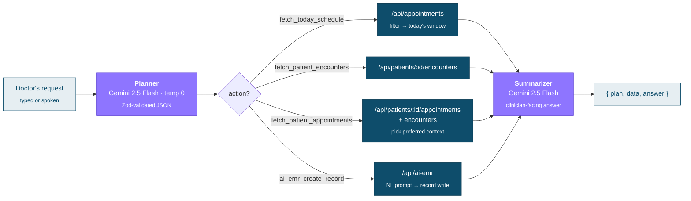
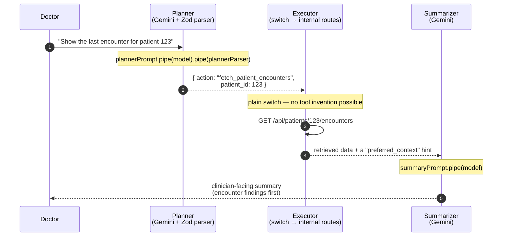

<div align="center">

# HELIX

### Agentic AI-powered medical records for African clinics.

Doctors describe what they need in plain language — *"what's on my schedule today?"*, *"pull the last encounter for patient 123"*, *"book patient 99 in for 3pm"* — and Helix plans the action, fetches the data, and writes back the record. An **agentic EMR** that turns clinical intent into structured operations, so the paperwork stops competing with the patient.

Fast documentation. Smarter scheduling. Complete patient care.

<br/>

[](https://nextjs.org)
[](https://react.dev)
[](https://www.typescriptlang.org)
[](https://js.langchain.com)
[](https://ai.google.dev)
[](https://firebase.google.com)
[](https://zustand-demo.pmnd.rs)
[](https://tailwindcss.com)

**[▶ Live demo — helixhq.vercel.app](https://helixhq.vercel.app/)**  ·  **[▶ Watch the walkthrough](https://www.youtube.com/watch?v=zYk63ZEa52Y)**

</div>

---

<div align="center">

<br/>
<sub><b>The pitch</b> · "Agentic AI-Powered Medical Records for African Clinics." The hero previews the doctor workspace — a tabbed calendar with an appointment popover for a completed malaria-test visit.</sub>
</div>

<br/>

<table>
<tr>
<td width="50%" valign="top">
<br/>
<sub><b>CoBrain, the in-app agent</b> · A quick-access popover takes plain language — <i>"help schedule an appointment with patient 99 today for 3pm"</i> — with voice input alongside the text field.</sub>
</td>
<td width="50%" valign="top">
<br/>
<sub><b>Patient Finder</b> · Search patients by name, phone, or email inside a browser-style, multi-tab workspace with a mini-calendar sidebar — open Calendar, Appointments, and Message Center side by side.</sub>
</td>
</tr>
</table>

---

## Table of contents

- [The problem](#the-problem)
- [The idea: describe the task, not the clicks](#the-idea-describe-the-task-not-the-clicks)
- [How a request flows](#how-a-request-flows)
- [Signature engineering: a bounded plan → execute → summarize chain](#signature-engineering-a-bounded-plan--execute--summarize-chain)
- [The four actions in detail](#the-four-actions-in-detail)
- [Writing records from natural language](#writing-records-from-natural-language)
- [Speed where it counts: client-side data caching](#speed-where-it-counts-client-side-data-caching)
- [The doctor workspace](#the-doctor-workspace)
- [Roles & auth](#roles--auth)
- [Tech stack](#tech-stack)
- [Project structure](#project-structure)
- [Getting started](#getting-started)
- [Environment variables](#environment-variables)
- [Notes & known rough edges](#notes--known-rough-edges)
- [Credits](#credits)

---

## The problem

A clinic EMR is a database with a hundred forms in front of it. In a busy African clinic — high patient volume, thin staffing, limited time per visit — those forms are where the day disappears. Every lookup is a navigation. Every note is a screen of fields. The doctor ends up serving the software instead of the patient.

Helix keeps the database and **replaces the forms with an agent**. The doctor states an intent in one sentence; Helix figures out which record operation it maps to, runs it, and returns a summary written for a clinician. The mechanical layer — which endpoint, which parameters, which shape of data — is the machine's job now.

## The idea: describe the task, not the clicks

The embedded assistant is called **CoBrain**. It sits one click away anywhere in the workspace (the "Quick CoBrain" popover) and accepts typed or spoken input.

| A doctor says… | CoBrain does |
| --- | --- |
| *"What's on my schedule today?"* | Fetches every appointment for the current day, summarizes patients / times / reasons |
| *"Show me the last encounter for patient 123"* | Pulls encounter history (notes, vitals, diagnoses) and leads the summary with clinical findings |
| *"When is patient 88 next in?"* | Retrieves that patient's appointments **and** recent encounters, prefers encounter data as the source of truth |
| *"Book patient 99 for 3pm today with reason malaria test"* | Composes a natural-language EMR write and creates the record through the external EMR service |

Everything the agent can do is a **closed set of four actions** — not an open-ended tool sandbox. That's a deliberate safety choice for a medical context: the model chooses *which* record operation to run, but it can never invent one, and it can never reach outside the four routes below.

## How a request flows



## Signature engineering: a bounded plan → execute → summarize chain

The whole assistant lives in one route — [app/api/assistant/route.ts](app/api/assistant/route.ts) — and it is intentionally **not** a LangChain tool-calling agent. Letting an LLM freely call tools against live patient records is exactly the failure mode you don't want in a clinic. Helix constrains it to a two-model chain where the model's only creative decision is picking one of four named actions and filling a typed payload.



**Stage 1 — Planning.** `plannerPrompt.pipe(model).pipe(plannerParser)` runs the request through Gemini, and `plannerParser` — a LangChain `StructuredOutputParser` built from a **Zod schema** — forces the output into JSON or fails. The schema is strict:

```ts
const plannerSchema = z.object({
  action: z.enum([
    'fetch_patient_encounters',
    'fetch_patient_appointments',
    'fetch_today_schedule',
    'ai_emr_create_record',
  ]),
  patient_id: z.number({ coerce: true }),
  limit: z.number({ coerce: true }).optional(),
  payload: z.object({
    date, reason, summary, status, symptoms, diagnosis, note,
    follow_up, medications, vitals, tests, encounter_type, prompt,
  }).partial().optional(),
  notes: z.string().optional(),
})
```

The `action` field is a four-value enum — the model can *choose*, but not extend. If a request can't be satisfied by any action, the planner is instructed to pick the closest one and explain the gap in `notes`.

**Stage 2 — Execution.** A plain `switch` on `plan.action` maps the choice to an internal Next.js route. No dynamic dispatch, no reflection — a reviewer can read every path the agent can take. The base URL is derived from the incoming request (or `VERCEL_URL` / `APP_BASE_URL` as a fallback), so it works the same locally and on Vercel.

**Stage 3 — Summarizing.** The retrieved data is handed to a second Gemini call (`summaryPrompt.pipe(model)`) that writes the clinician-facing answer. Where the executor identified a **`preferred_context`** (see below), it's injected as an explicit "primary source of truth" hint so the summary leads with the right record.

**One traceable response.** The route returns `{ plan, data, answer }` in a single `NextResponse.json` — the plan the model chose, the raw data it acted on, and the prose — so every answer is auditable back to its source rows. Both stages run at **`temperature: 0`** for reproducible planning and summaries.

> The assistant is **non-streaming** by design (`.invoke()`, one JSON response). There are no latency benchmarks in this codebase — the engineering win here is *architectural*: a medical agent whose action space is provably bounded, not a speed claim.

## The four actions in detail

| Action | What the executor does | Endpoint(s) |
| --- | --- | --- |
| `fetch_patient_encounters` | Retrieves encounter history for a patient (`limit` optional) | `GET /api/patients/:id/encounters` |
| `fetch_patient_appointments` | Fetches appointments **and** encounters in parallel, then sets `preferred_context` to the latest encounter (falling back to the latest appointment) | `GET /api/patients/:id/appointments` + `.../encounters` |
| `fetch_today_schedule` | Pulls all appointments and filters to a `[today, tomorrow)` window client-side, plus supplemental encounters | `GET /api/appointments` |
| `ai_emr_create_record` | Builds a natural-language EMR prompt and creates/modifies a record via the AI-EMR proxy | `POST /api/ai-emr` |

The **`preferred_context`** mechanism is the quiet clever bit: for a "what's going on with this patient?" style question, appointment metadata (time, reason) is far less useful than the last encounter (diagnosis, vitals, plan). So the executor pre-selects the encounter as the source of truth and *tells the summarizer to trust it first* — the model doesn't have to guess which record matters.

## Writing records from natural language

The `ai_emr_create_record` path turns a doctor's sentence into a structured EMR write without the model ever touching the database directly. `buildAiPrompt()` reconstructs a clean instruction:

1. Start from the planner's `payload.prompt` (the doctor's verbatim instruction) — or synthesize one from the original message.
2. Flatten any structured details the planner extracted (`date`, `vitals`, `medications`, `diagnosis`, `follow_up`, …) into readable `key: value` lines appended under **"Important structured details"**.
3. **Truncate to 900 characters** (`truncatePrompt`) so the downstream service gets a bounded prompt.

That composed prompt is POSTed to [app/api/ai-emr/route.ts](app/api/ai-emr/route.ts), a thin proxy that requires both `prompt` and `patient`, attaches a `Token`-scheme `Authorization` header from `API_KEY`, and forwards to the external EMR service (`{API_BASE}/ai/emr`). The proxy exists so the API token never reaches the browser and so CORS is handled server-side.

## Speed where it counts: client-side data caching

The agent is deliberate; the UI stays snappy because it rarely re-hits the API. Five [Zustand](stores/) stores cache API data on the client with a **5-minute freshness window** and skip the network entirely on a cache hit:

```ts
// stores/appointments-store.ts
if (!forceRefresh && state.lastFetched && state.currentEndpoint === apiEndpoint) {
  if (Date.now() - state.lastFetched < state.cacheDuration) {
    return // 📦 still fresh — no fetch
  }
}
```

| Store | Caches | Notable |
| --- | --- | --- |
| [appointments-store.ts](stores/appointments-store.ts) | Global + per-patient appointments | Cache key includes endpoint **and** selected patient; optimistic update/delete |
| [patients-store.ts](stores/patients-store.ts) | Paginated patient list | Supports ordering / page / search params |
| [patient-records-store.ts](stores/patient-records-store.ts) | Per-patient appointments, encounters & tests | Keyed by patient ID via `Map`, each with its own cache timestamp |
| [encounter-detail-store.ts](stores/encounter-detail-store.ts) | Individual encounters by ID | **De-duplicates in-flight requests** so concurrent opens fetch once |
| [calendar-store.ts](stores/calendar-store.ts) | Selected calendar date | Pure UI state |

Cache duration is tunable per store via `setCacheDuration`, and `clearCache` / `forceRefresh` bypass it after a write.

## The doctor workspace

The dashboard is a **browser-style, multi-tab workspace** — open Calendar, Patient Finder, Appointments, Message Center, and Notifications as independent tabs and switch between them without losing state (tab state lives in [contexts/TabContext.tsx](contexts/TabContext.tsx) and [contexts/PatientTabContext.tsx](contexts/PatientTabContext.tsx)).

- **Calendar** — Day / Week / Month views with appointment indicators, a mini-calendar sidebar, and hover/click popovers showing appointment ID, patient, reason, time, and status.
- **Patient Finder** — search the patient roster by name, phone, or email in a sortable table.
- **CoBrain** — the agent, reachable from the top bar anywhere in the app, with voice input.
- **Messages & Notifications** — message center and clinic notifications, backed by Firestore.

## Roles & auth

Helix serves two user types, distinguished by a `userType` field (`'doctor' | 'patient'`) written to each user's Firestore document at sign-up — see [lib/firebase/auth.ts](lib/firebase/auth.ts). [contexts/AuthContext.tsx](contexts/AuthContext.tsx) subscribes to `onAuthStateChanged`, loads that Firestore profile, and exposes `{ user, userData, loading }` via the `useAuth()` hook so the UI can gate doctor vs patient views.

- **Doctors** — full workspace: tabbed calendar, patient finder, CoBrain, records, messaging.
- **Patients** — profile & health info, appointment booking, and AI chat.

Email/password and Google sign-in are both supported through the **Firebase client SDK** (no admin SDK); Google sign-in defaults new users to the `patient` role.

## Tech stack

| Layer | Technology |
| --- | --- |
| Framework | **Next.js 16** (App Router, Route Handlers) · **React 19** · TypeScript 5 |
| AI orchestration | **LangChain 0.3** (`langchain`, `@langchain/core`) |
| Model | **Google Gemini 2.5 Flash** via `@langchain/google-genai` (`ChatGoogleGenerativeAI`) |
| Structured output | LangChain `StructuredOutputParser` + **Zod** schema (typed planning) |
| Auth & data | **Firebase** client SDK — Firebase Auth + Cloud Firestore |
| State / caching | **Zustand 5** — five API-caching stores with a 5-min freshness window |
| UI | **Radix UI** (27 primitives) · **Tailwind CSS 4** · `react-day-picker` calendar |
| API layer | Next.js Route Handlers proxying an external EMR API (Token auth, CORS) |

## Project structure

```
helix/
├── app/
│   ├── (doctor)/                # Doctor route group
│   │   └── dashboard/           # ★ Tabbed clinical workspace (calendar, finder, messages)
│   ├── (patient)/               # Patient route group
│   │   ├── patient-dashboard/   # Patient home
│   │   └── patient/complete-profile/
│   ├── api/
│   │   ├── assistant/route.ts   # ★ CoBrain — the plan→execute→summarize agent
│   │   ├── ai-emr/route.ts      # ★ Natural-language record writes → external EMR (Token auth)
│   │   ├── ai/chat/route.ts     # Patient chat (Gemini fallback / placeholder)
│   │   ├── appointments/        # list · create · [id] · cancel · reschedule
│   │   ├── patients/            # list · create · create-via-ai · [id] · encounters · tests
│   │   ├── encounters/          # encounter records
│   │   ├── chat/                # conversation history
│   │   └── webhooks/            # pharmavigilance · register · test
│   ├── page.tsx                 # Landing page
│   └── layout.tsx
├── components/                  # auth · doctor · patient · landing · ui (Radix)
├── contexts/                    # AuthContext · TabContext · PatientTabContext
├── hooks/                       # use-appointments · use-notifications · use-toast · use-mobile
├── lib/
│   ├── api/                     # config + appointments/encounters/patients/tests clients
│   ├── firebase/                # config · auth · chat · messaging · notifications
│   └── utils.ts
├── stores/                      # ★ 5 Zustand caching stores
└── public/
```

## Getting started

**Prerequisites:** Node.js 18+ and a package manager (npm, pnpm, or bun — lockfiles for npm and pnpm are checked in).

```bash
git clone https://github.com/victorjayeoba/helix.git
cd helix
npm install
```

Create a `.env.local` (see below), then:

```bash
npm run dev      # http://localhost:3000
```

**Scripts:** `dev` · `build` · `start` · `lint`

## Environment variables

Create `.env.local` in the project root:

```env
# Firebase (client SDK)
NEXT_PUBLIC_FIREBASE_API_KEY=your_firebase_api_key
NEXT_PUBLIC_FIREBASE_AUTH_DOMAIN=your_auth_domain
NEXT_PUBLIC_FIREBASE_PROJECT_ID=your_project_id
NEXT_PUBLIC_FIREBASE_STORAGE_BUCKET=your_storage_bucket
NEXT_PUBLIC_FIREBASE_MESSAGING_SENDER_ID=your_sender_id
NEXT_PUBLIC_FIREBASE_APP_ID=your_app_id

# Gemini — required for the CoBrain agent to plan & summarize
GOOGLE_GENERATIVE_AI_API_KEY=your_gemini_api_key
GEMINI_API_KEY=your_gemini_api_key

# External EMR API (proxied via /api/ai-emr, Token-scheme auth)
API_KEY=your_external_api_key
```

| Variable | Used for |
| --- | --- |
| `NEXT_PUBLIC_FIREBASE_*` | Firebase Auth + Firestore (client SDK) |
| `GOOGLE_GENERATIVE_AI_API_KEY` | The agent's Gemini calls in `/api/assistant` — **without it the agent throws** |
| `GEMINI_API_KEY` | The patient-chat fallback route (`/api/ai/chat`) |
| `API_KEY` | `Token` auth to the external EMR service behind `/api/ai-emr` |

## Notes & known rough edges

Honest state of the code, so you're not surprised reading the source:

- The npm package name in `package.json` is still **`my-v0-project`** — a v0 scaffold leftover, not `helix`.
- [lib/firebase/config.ts](lib/firebase/config.ts) contains **hard-coded fallback Firebase credentials** (project `helix-9fce1`) used when the env vars are absent. Move these to env-only before any real deployment.
- The AI assistant is **non-streaming** and there are **no performance benchmarks** in the repo — treat "fast" in the copy as a product goal, not a measured number.
- `/api/ai/chat` is a **placeholder** that returns a canned response unless `GEMINI_API_KEY` is set; the real agent is `/api/assistant`.

## Credits

| | |
| --- | --- |
| **Victor Jayeoba** | Author — [victorjayeoba.me](https://www.victorjayeoba.me) |
| **David Adedeji** | Collaborator — [LinkedIn](https://www.linkedin.com/in/1davidadedeji/) |

---

<div align="center">
<sub>Built for African healthcare providers — so the record-keeping gets out of the doctor's way.</sub>
</div>
